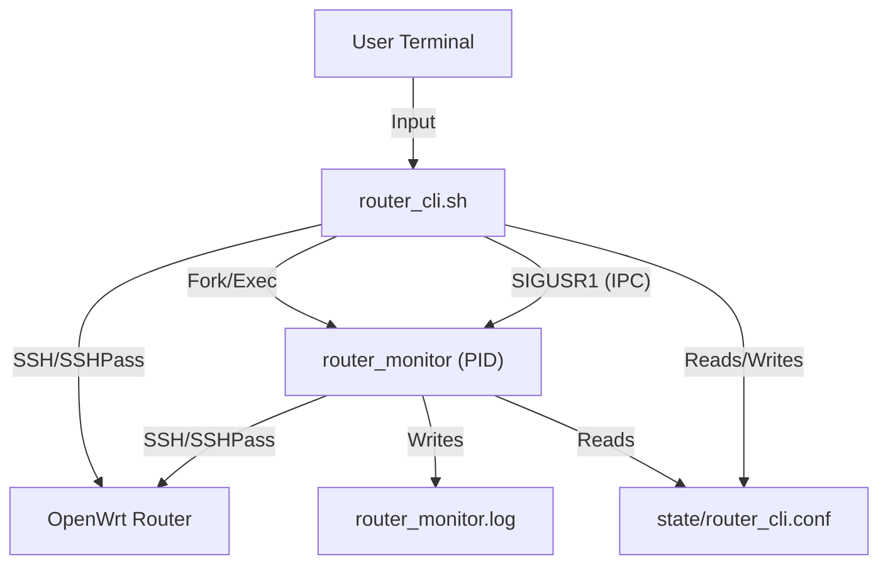

# System Architecture & Technical Reference

This document provides a deep technical dive into the **Router CLI & Monitor System**. It details the architectural decisions, inter-process communication (IPC) mechanisms, and internal logic of the components.

## 1. High-Level Architecture

The system operates on a **Split-Process Architecture**, consisting of two distinct, coupled components:

1.  **The Controller (`router_cli.sh`)**: A Bash-based REPL (Read-Eval-Print Loop) that handles user interaction, command parsing, local state validation, and remote command execution.
2.  **The Observer (`router_monitor`)**: A compiled C binary running as a background daemon, responsible for asynchronous state verification and logging.



---

## 2. Component Reference

### 2.1 The Controller: `router_cli.sh`

The CLI is designed as a **State Machine**. It maintains a global `MODE` variable that dictates which command processor is active.

*   **State Machine Phases**:
    *   `USER`: Minimal access (`enable`, `exit`).
    *   `PRIVILEGED`: Operational mode (`show`, `apply`, `conf t`).
    *   `CONFIG`: Global configuration (`hostname`, `interface`, `wireless`).
    *   `INTERFACE`: Interface-specific config (`ip address`, `shutdown`).
    *   `WIRELESS`: WiFi-specific config (`ssid`, `channel`).

*   **Command Queuing System**:
    *   To support transactional behavior ("apply changes"), the CLI uses a Bash array `PENDING_COMMANDS`.
    *   Commands are not sent immediately (except for `show` commands). They are buffered.
    *   Upon `apply`:
        1.  Loop mechanism iterates through `PENDING_COMMANDS`.
        2.  Each command is wrapped in `sshpass ... ssh ...` and executed sequentially.
        3.  Wait for exit code 0.
        4.  If Wireless commands were present, `uci commit` and `wifi reload` acts are injected.
        5.  `SIGUSR1` is sent to the Monitor.

*   **Signal Traps**:
    *   `trap "kill $MONITOR_PID" EXIT`: Registers a kernel-level trap on the script's exit signal to ensure the child process (`router_monitor`) is orphaned and cleaned up immediately, preventing zombie processes.

### 2.2 The Observer: `router_monitor.c`

The Monitor is a C99-compliant daemon designed for **Event-Driven execution**.

*   **Main Loop**:
    *   Uses `sigaction` to register handlers for `SIGUSR1`, `SIGINT`, and `SIGTERM`.
    *   Enters an infinite `sleep()` loop to conserve CPU cycles (0% idle usage).
    *   Only wakes upon receiving a signal (Soft Interrupt).

*   **Dynamic Configuration Parsing**:
    *   The monitor does **logic duplication** regarding connectivity. It does *not* accept arguments. using `read_config_value()`, it parses `state/router_cli.conf` at runtime.
    *   This ensures that if the CLI changes the target configuration (`ROUTER_IP`), the monitor adapts instantly without a restart.

*   **Remote Execution (Active Fetching)**:
    *   Uses `popen()` to spawn a shell for providing the IPC pipe.
    *   Constructs a dynamic command string: `sshpass -p <PASS> ssh -o StrictHostKeyChecking=no <USER>@<IP> "<COMMANDS>"`.
    *   Parses stdout line-by-line using `fgets` and prepends timestamps.

---

## 3. Inter-Process Communication (IPC)

The system uses a hybrid IPC model:

1.  **Control Plane (Signals)**:
    *   **Synchronization**: The CLI uses `SIGUSR1` to notify the Monitor that "External State has changed". This triggers the Monitor's `fetch_router_updates()` routine.
    *   **Lifecycle**: The CLI uses `SIGTERM` to enforce the lifecycle of the Monitor.

2.  **Data Plane (Files)**:
    *   **Shared State**: `state/router_cli.conf` acts as the shared memory segment.
        *   **Writer**: `router_cli.sh` (exclusive write access during startup/config).
        *   **Reader**: `router_monitor.c` (read-only access during update cycles).
    *   **Schema**:
        ```ini
        router_ip=192.168.1.1
        router_port=22
        username=root
        password=secret
        hostname=OpenWrt
        ```

---

## 4. Networking Protocols

### 4.1 SSH Transport Layer
The system enforces specific SSH options to maximize compatibility with embedded routers (often running older Dropbear versions):
*   `-o StrictHostKeyChecking=no`: Disables interactive host verification (essential for automation).
*   `-o HostKeyAlgorithms=+ssh-rsa`: Forces usage of legacy RSA keys (often disabled in modern OpenSSL).
*   `-o PubkeyAcceptedKeyTypes=+ssh-rsa`: Accepts RSA public keys.

### 4.2 OpenWrt UCI Subsystem
The system abstracts the OpenWrt **Unified Configuration Interface (UCI)**:
*   **Set**: `uci set <config>.<section>.<option>='<value>'` (buffers change in RAM).
*   **Commit**: `uci commit <config>` (flushes RAM buffer to `/etc/config/`).
*   **Reload**: `/etc/init.d/<service> reload` or `wifi reload` (applies config to running daemons).

The CLI abstracts this complexity; the user types `ssid MyNet`, and the CLI generates the specific `uci` chain required.
